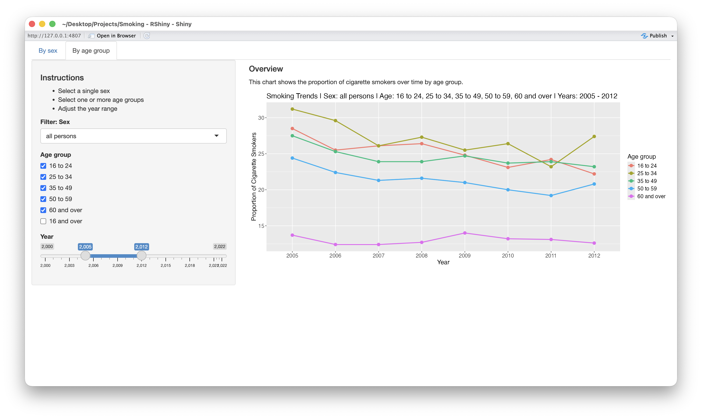

# Great Britain Adult Smoking Habits Visualisation
This R Shiny application allows users to explore and visualise annual trends in adult cigarette smoking in Great Britain, by sex and age group.

## App Preview


## Project Structure
```text
RShiny - smoking.Rproj
app.R
data_processing.R
ui.R
server.R
data/
    adultsmokinghabitsingreatbritain.xlsx
README.md
```
- **app.R** – Main entry point that sources the other scripts and launches the Shiny app.
- **data_processing.R** – Reads and processes the Excel dataset into a tidy format.
- **ui.R** – Defines the Shiny user interface with tabs for sex and age group analysis.
- **server.R** – Contains the server logic, generating interactive plots with `ggplot2`.
- **data/adultsmokinghabitsingreatbritain.xlsx** – Original dataset from the Office for National Statistics.

## Data Source
The dataset used in this app was downloaded from the [Office for National Statistics](https://www.ons.gov.uk/peoplepopulationandcommunity/healthandsocialcare/drugusealcoholandsmoking/datasets/adultsmokinghabitsingreatbritain) released on 5 September 2023.

## Prerequisites 
- **R** (≥ 4.0 recommended)
- **RStudio** (optional, for a better development environment) 
- Required R libraries: 
    - `readxl` - Excel import
    - `stringr` - Text processing
    - `tidyr`& `dplyr` - Data wrangling
    - `shiny` - Interactive web application
    - `ggplot2` - Visualisation
- Install missing packages with:
```r
install.packages(c("readxl", "stringr", "tidyr", "dplyr", "shiny", "ggplot2"))
```

## Data Processing
The data_processing.R script performs the following tasks:
1. Reads the Excel file `data/adultsmokinghabitsingreatbritain.xlsx` from sheet Table_1 and a specified range.
2. Cleans column names and reshapes the data from wide to long format.
3. Extracts variables:
    - `year` – Survey year
    - `sex` – Sex category (men, women, all persons)
    - `age` – Age group
    - `prop_cigarette_smokers` – Proportion of smokers
4. Filters for weighted observations only.

## Shiny App Overview
The app consists of two main tabs:
1. By Sex – Compare smoking proportions across sexes for a chosen age group and year range.
2. By Age Group – Compare smoking proportions across age groups for a chosen sex and year range.

## User Controls
- **Checkboxes** – Select one or more sexes or age groups.
- **Dropdown menus** – Filter by sex or age group.
- **Sliders** – Select a year range.

Plots dynamically update based on the selected filters.

## Usage
1. Open app.R in R or RStudio.
2. Ensure the Excel dataset (adultsmokinghabitsingreatbritain.xlsx) is in the data/ folder.
3. Run app.R — it will automatically source the data processing, UI, and server scripts.
4. The Shiny app window will open with two tabs:
    - By Sex – View trends across sexes for a selected age group and year range.
    - By Age Group – View trends across age groups for a selected sex and year range.
5. Use the checkboxes, dropdowns, and sliders to filter the data and dynamically update the plots.
